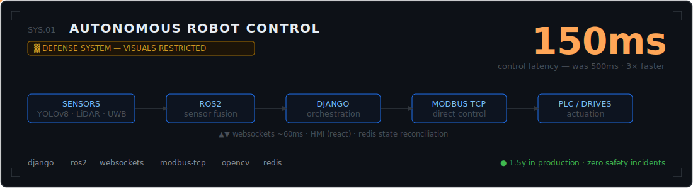
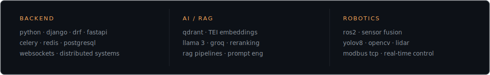

<picture>
  <source media="(prefers-color-scheme: dark)" srcset="assets/hero-dark.svg">
  
</picture>

<p align="center">
  I build backends that talk to robots, LLMs, and 60,000 sensors — and stay up.<br>
  <sub><b>open to:</b> backend / systems-integration roles in robotics, AI, high-growth startups &nbsp;·&nbsp; <a href="https://linkedin.com/in/abhishek-rajput-4ba60221a">linkedin</a> · <a href="mailto:abhishek.rajput7202@gmail.com">email</a> · <a href="https://systemsabhishekrajput.hashnode.dev">blog</a></sub>
</p>

<br>



```text
┌─────────┐  yolov8 · 3d lidar · uwb → ros2 sensor fusion
│ SENSORS ├──────────────────┐
└─────────┘                  ▼
┌─────────┐  ws ~60ms  ┌─────────────────────────┐  modbus tcp ~40ms  ┌────────┐
│   HMI   │◄──────────►│  django orchestrator    │◄──────────────────►│ plc /  │
│ (react) │            │  + redis state reconcile│                    │ drives │
└─────────┘            └─────────────────────────┘                    └────────┘
                       total control loop: ~150ms   (legacy plc path: 500ms)
```

<details>
<summary>&nbsp;the HMI is classified, so here it is in ascii ↓</summary>

```text
┌─ teleop console ────────────────────────────────────────── ● LIVE ─┐
│                                                                    │
│  ┌──────────────────────┐   vel 0.8 m/s      heading 214°          │
│  │                      │   batt ▓▓▓▓▓▓▓░░ 87%                     │
│  │    [ camera feed ]   │   mode: AUTO       e-stop: ARMED         │
│  │                      │                                          │
│  └──────────────────────┘   obstacle: CLEAR  (lidar ∅ 4.2m)        │
│                                                                    │
│  [ HOLD ]  [ RESUME ]  [ DOCK ]              uwb fix: ±10cm        │
└─ zero safety incidents · 1.5y in production ───────────────────────┘
```

</details>

<sub>[architecture](https://excalidraw.com/#json=fcp0jF_oETfRzEMimgbsv,fW-qgNg7sEZ2U1_GQrdSBg) · [how we went from PLC-heavy control to a sub-150ms web HMI →](https://systemsabhishekrajput.hashnode.dev/modernizing-defense-robotics-from-plc-heavy-control-to-a-sub-150ms-web-orchestrated-hmi)</sub>

<br><br>



```text
 ingest:  docs ──► ocr ──► semantic chunks ──► tei embeddings ──► qdrant
                                                                     │
 query:   user ──► embed ─────────────────────► top-k retrieval ◄────┘
                                                       │
                                          cross-encoder rerank
                                                       │
                                       llama 3 ──► answer   ~1.5–2s e2e
```


<sub>[architecture](https://excalidraw.com/#json=WxdU0V5sXS3nq6P_Y6B64,JiHbZ1uTvnB1_zVRGzv5hA) · [full demo video](https://github.com/user-attachments/assets/8a085ae0-b3b3-487c-a681-ca29f5237222)</sub>

<br><br>



```text
 20+ facilities ──► gateways ──► celery ingest ──► redis (hot) ──► postgres
     60k tags                        │
                                     └──► ws fan-out ──► dashboards (500+ users)
```

<br>



<br>


<p align="center">
  <sub>⌘ built by hand — every svg and ascii diagram in this readme is hand-written, like the systems above</sub>
</p>
